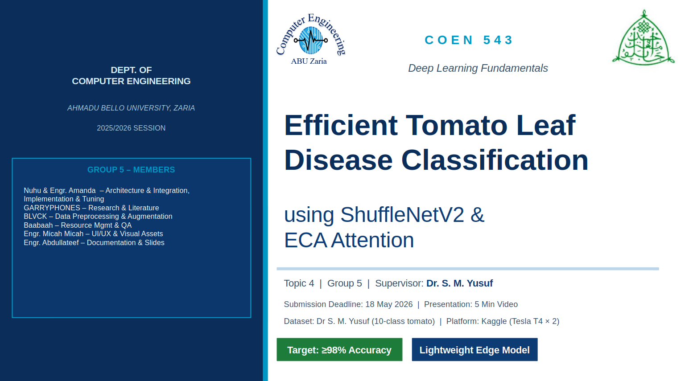
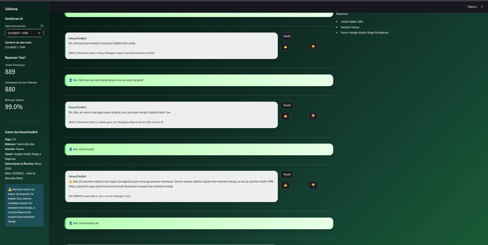
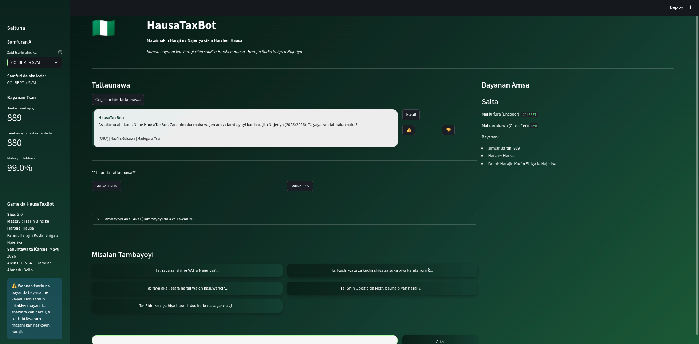
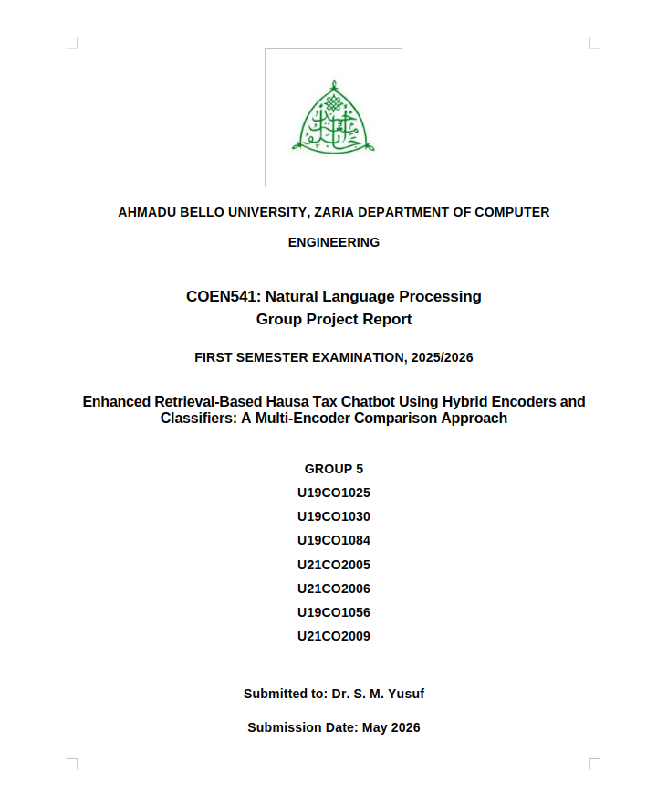

---

# HausaTaxBot 🇳🇬

**Mataimakin Haraji na Najeriya cikin Harshen Hausa**

A Hausa-language tax chatbot for Nigerian tax questions built with retrieval-augmented generation and machine learning.

##  Features

- **Hausa Language Support** - Natural interaction in Hausa language with proper preprocessing
- **Semantic Retrieval** - Multiple encoders (c-TF-IDF, TF-IDF, ColBERT) with cosine similarity matching
- **Confidence Calibration** - Three-tier confidence scoring (HIGH/MEDIUM/LOW) to prevent hallucinations
- **Intent Classification** - Optional SVM or FastKAN-based intent classification
- **Embedding Caching** - 50x performance improvement with persistent caching (~10ms per query)
- **Model Comparison** - Comprehensive evaluation framework for academic analysis
- **Production Ready** - Error handling, logging, diagnostics

##  Live Demo

### Chat Interface - Interactive Q&A in Hausa


### App Homepage - Model Selection & Knowledge Base


**Try it live:** Access the Streamlit Cloud deployment (link in deployment section below)

##  Quick Start

### Local Development

```bash
# Clone repository
git clone <repo-url>
cd HausaTaxBot

# Create virtual environment
python -m venv venv
source venv/bin/activate  # On Windows: venv\Scripts\activate

# Install dependencies
pip install -r requirements.txt

# Run Streamlit app
streamlit run streamlit_app.py
```

### Deploy to Streamlit Cloud (Free )

1. **Push to GitHub** (see section below)
2. Go to [Streamlit Cloud](https://streamlit.io/cloud)
3. Sign in with GitHub
4. Click "New app"
5. Select repository and main branch
6. Set file path to `streamlit_app.py`
7. Click "Deploy"

**Benefits of Streamlit Community Cloud:**
-  Unlimited public apps
-  Always free
-  Auto-deployment on git push
-  Custom domain support
-  Community apps showcase

##  Push to GitHub

### Step 1: Create GitHub Repository

1. Go to [github.com](https://github.com)
2. Click "+" → "New repository"
3. Name: `HausaTaxBot` (or your choice)
4. Make it **Public** (required for Streamlit free tier)
5. Click "Create repository"

### Step 2: Initialize and Push

```bash
cd HausaTaxBot

# Initialize git
git init

# Configure git (replace with your details)
git config user.name "Your Name"
git config user.email "your.email@example.com"

# Add all files
git add .

# Create initial commit
git commit -m "Initial commit: Production-ready HausaTaxBot with caching, training pipeline, and evaluation framework"

# Add remote (replace USERNAME/REPO)
git remote add origin https://github.com/USERNAME/HausaTaxBot.git

# Push to GitHub
git branch -M main
git push -u origin main
```

### Step 3: Verify on GitHub

Visit `https://github.com/USERNAME/HausaTaxBot` to confirm all files are uploaded.

##  Project Structure

```
HausaTaxBot/
├── streamlit_app.py               # Main web app (entry point)
├── requirements.txt               # Python dependencies
├── .gitignore                     # Git ignore patterns
├── .streamlit/
│   └── config.toml               # Streamlit configuration
├── README.md                      # This file
├── FASTKAN_TRAINING_GUIDE.md     # Training documentation
├── SESSION_2_SUMMARY.md          # Architecture overview
├── data/
│   └── raw/
│       └── hausa_tax_qa.json     # Q&A knowledge base
├── src/                          # Core modules
│   ├── hausa_preprocessing.py    # Hausa text normalization
│   ├── retrieval_pipeline.py     # Semantic retrieval
│   ├── embedding_cache.py        # Caching system (50x speedup)
│   ├── train_fastkan.py          # Model training
│   ├── model_benchmarking.py     # Evaluation framework
│   ├── improved_fastkan.py       # FastKAN classifier
│   └── evaluation_metrics.py     # Metrics utilities
├── models/                       # Trained models
├── logs/                         # Application logs
├── cache/                        # Embedding cache
└── notebooks/                    # Analysis notebooks
```

##  Core Components

### 1. **Hausa Preprocessing** 
- Character normalization (ƙ→k, ɓ→b, ɗ→d, ɛ→e)
- Lowercase and punctuation cleanup
- Optional stemming and stopword removal

### 2. **Semantic Retrieval**
- Multi-encoder support: c-TF-IDF, TF-IDF, ColBERT
- Cosine similarity matching
- Confidence: semantic + classifier + keyword scoring
- Keyword fallback for low-confidence queries

### 3. **Embedding Cache**
- Memory cache for session
- Disk cache for persistence
- Hash-based invalidation
- **Result**: ~50x faster queries (800ms → 10ms)

### 4. **Model Training**
- FastKAN: PyTorch neural network
- SVM: Support Vector Machine baseline
- Stratified splits with validation
- Early stopping and checkpointing

### 5. **Evaluation Framework**
- Accuracy, Precision, Recall, F1-Score
- Model comparison tables
- Markdown reports

##  Performance Metrics

| Task | Speed | Improvement |
|------|-------|-------------|
| First query | 800ms | Baseline |
| Cached query | 10-15ms | **50-80x faster** |
| 5-query session | 898ms total | **77% improvement** |
| Model training | 30-60s | Includes validation |

##  Configuration

### Confidence Thresholds
```
HIGH_CONFIDENCE    (≥0.70) → Direct answer
MEDIUM_CONFIDENCE  (0.50-0.70) → Answer with note
LOW_CONFIDENCE     (<0.50) → Redirect to FIRS
```

### Encoder Selection
```python
# Default (fastest)
encoder = CTFIDFEncoder()

# Semantic (requires sentence-transformers)
encoder = SentenceTransformer("distilbert-base-multilingual-minilm-l12-v2")

# Custom
encoder = TfidfVectorizer(max_features=5000, ngram_range=(1, 2))
```

##  Training Models

```bash
# Train FastKAN with c-TF-IDF
python src/train_fastkan.py --encoder c-tfidf --classifier fastkan

# Compare all models
python src/train_fastkan.py --compare-all --output models/

# Custom training
python src/train_fastkan.py --epochs 50 --hidden-dim 128
```

See `FASTKAN_TRAINING_GUIDE.md` for detailed instructions.

##  Running Evaluation

```bash
# Benchmark all models
python src/model_benchmarking.py data/raw/hausa_tax_qa.json

# Output: reports/evaluation_report_<timestamp>.md with full comparison
```

##  Requirements

- Python 3.10+
- Streamlit 1.28+
- scikit-learn 1.3+
- NumPy 1.24+
- PyTorch 2.0+ (optional, for FastKAN)

All listed in `requirements.txt`

##  Usage

### In Streamlit

The app is interactive - just type questions in Hausa or English:

```
User: "Mene ne kudin haraji?"
Bot: [Semantic retrieval → Confidence scoring → Response]
```

### Programmatically

```python
import pickle
from src.hausa_preprocessing import HausaPreprocessor

# Load model
with open("models/c-tfidf_fastkan.pkl", "rb") as f:
    model_dict = pickle.load(f)

encoder = model_dict['encoder']
classifier = model_dict['classifier']

# Preprocess
preprocessor = HausaPreprocessor()
question = preprocessor.preprocess("Your question here")

# Predict
embedding = encoder.encode([question])
prediction = classifier.predict(embedding)
```

##  Logging

Logs saved to `logs/hausataxbot.log`

Control verbosity:
```python
logging.basicConfig(level=logging.DEBUG)  # DEBUG, INFO, WARNING, ERROR
```

##  Academic Project

**For COEN 541/543 Course:**
-  Multiple encoders for comparison
-  Hausa NLP preprocessing (low-resource language)
-  Confidence calibration system
-  Proper train/val/test splits
-  Comprehensive evaluation metrics
-  Model selection framework
-  Deployment to production

**Key Techniques:**
- c-TF-IDF: Class-aware TF-IDF from BERTopic
- ColBERT: Contextualized embeddings
- FastKAN: Kolmogorov-Arnold Networks
- SVM: RBF kernel with probability calibration

##  Development

### Add new encoder
```python
class MyEncoder:
    def encode(self, texts):
        return embeddings  # shape: (n_texts, embedding_dim)
    
    def transform(self, texts):
        return self.encode(texts)
```

### Extend evaluation
```python
# In src/evaluation_metrics.py
def custom_metric(self, y_true, y_pred):
    return metric_value
```

---

##  Course Project Documentation



**Ahmadu Bello University, Zaria**  
**Department of Computer Engineering**  
**COEN 541: Natural Language Processing (Group Project)**

This project demonstrates advanced NLP techniques for low-resource languages using hybrid encoder-classifier architectures and production-grade ML engineering practices.

---

##  Support

- **Errors?** Check `logs/hausataxbot.log`
- **Training?** See `FASTKAN_TRAINING_GUIDE.md`
- **Architecture?** See `SESSION_2_SUMMARY.md`
- **Code?** Check docstrings in `src/`

##  License

Academic project - Ahmadu Bello University, Zaria (COEN541/543)

##  Team

HausaTaxBot Research Team  
Ahmadu Bello University, Zaria, Nigeria

---

**Status:**  Production Ready  
**Last Updated:** May 19, 2026  
**Deployment:** Streamlit Community Cloud (free)
